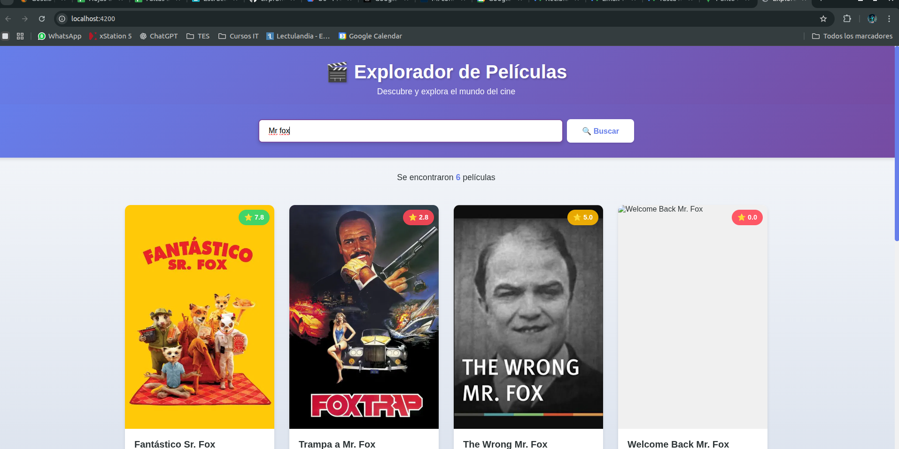

# 🎬 Explorador de Películas - Angular 18 + TMDb API

**Autor:** Noah Catalán  
**Fecha:** Noviembre 2025  
**Tecnologías:** Angular 18, TypeScript, RxJS, TMDb API

---

## 📋 Descripción del Proyecto

He desarrollado esta aplicación web interactiva como parte de mi formación en desarrollo frontend con Angular. La aplicación permite buscar películas en tiempo real utilizando la API pública de [The Movie Database (TMDb)](https://www.themoviedb.org/), implementando características modernas de Angular 18 como **Signals** para gestión de estado reactivo y **componentes standalone**.


*Interfaz principal del explorador de películas*


*Ejemplo de resultados de búsqueda*

---

## ✨ Características Principales

- 🔍 **Búsqueda en tiempo real** con optimización mediante `debounceTime` y `distinctUntilChanged`
- ⚡ **Gestión de estado reactivo** utilizando Angular Signals
- 🎨 **Diseño responsivo** adaptable a móviles, tablets y escritorio
- 🧩 **Arquitectura modular** con componentes standalone (sin NgModules)
- 🛡️ **Manejo robusto de errores** y estados de carga
- 🎯 **Separación de responsabilidades** (servicios, componentes inteligentes y presentacionales)

---

## 🛠️ Stack Tecnológico

| Tecnología | Versión | Propósito |
|------------|---------|-----------|
| Angular | 18.x | Framework principal |
| TypeScript | 5.4.x | Lenguaje de programación |
| RxJS | 7.8.x | Programación reactiva |
| TMDb API | v3 | Datos de películas |
| CSS Grid | - | Sistema de layout responsivo |

---

## 🚀 Configuración e Instalación

### Prerrequisitos

- **Node.js** v18.19.1 o superior
- **npm** 10.x o superior

### Pasos que seguí para configurar el entorno:

#### 1. **Instalación de NVM y Node.js 18**

```bash
# Instalé NVM (Node Version Manager)
curl -o- https://raw.githubusercontent.com/nvm-sh/nvm/v0.39.7/install.sh | bash

# Cargué NVM en la sesión actual
export NVM_DIR="$HOME/.nvm"
source "$NVM_DIR/nvm.sh"

# Instalé Node.js 18
nvm install 18
nvm use 18
nvm alias default 18

# Verifiqué la instalación
node --version  # v18.20.8
npm --version   # v10.8.2
```

#### 2. **Instalación del Proyecto**

```bash
# Cloné/descargué el proyecto
git clone <URL_DEL_REPOSITORIO>

# Navegué al directorio
cd "03- Explorador de una API asincronia y una UI interactiva"

# Instalé las dependencias
npm install
```

#### 3. **Configuración de la API Key**

La API Key de TMDb ya está configurada en `src/app/core/services/tmdb.service.ts`. Si deseas usar tu propia clave:

1. Obtén una API Key gratuita en [TMDb](https://www.themoviedb.org/settings/api)
2. Reemplaza el valor en `tmdb.service.ts`:
   ```typescript
   private apiKey = 'TU_API_KEY_AQUI';
   ```

#### 4. **Ejecución del Proyecto**

```bash
# Inicié el servidor de desarrollo
npm start

# La aplicación se abre automáticamente en:
# http://localhost:4200/
```

---

## 📁 Estructura del Proyecto

```
src/app/
├── core/
│   ├── models/
│   │   └── movie.model.ts          # Interfaces TypeScript
│   └── services/
│       └── tmdb.service.ts          # Servicio de comunicación con API
├── features/
│   └── movie-explorer/
│       ├── components/
│       │   ├── search-bar/          # Componente de búsqueda
│       │   └── movie-card/          # Componente de tarjeta de película
│       ├── movie-explorer.component.ts    # Componente principal
│       ├── movie-explorer.component.html
│       └── movie-explorer.component.css
├── app.component.ts                 # Componente raíz
├── app.config.ts                    # Configuración (provideHttpClient)
└── app.routes.ts                    # Definición de rutas
```

---

## 🎯 Conceptos Técnicos Implementados

### Angular Signals
Implementé Signals para gestión de estado reactivo:

```typescript
movies = signal<Movie[]>([]);
loading = signal<boolean>(false);
error = signal<string | null>(null);
```

### Optimización de Búsqueda con RxJS

```typescript
this.searchControl.valueChanges.pipe(
  debounceTime(300),
  distinctUntilChanged()
).subscribe(value => this.searchQuery.emit(value));
```

### Nueva Sintaxis de Control de Flujo (Angular 18)

```html
@if (loading()) {
  <div class="spinner"></div>
}

@for (movie of movies(); track movie.id) {
  <app-movie-card [movie]="movie"></app-movie-card>
}
```

---

## 🐛 Solución de Problemas

### Error: "Angular CLI requires minimum Node.js version v18.19"

```bash
# Solución: Actualizar Node.js usando NVM
nvm install 18
nvm use 18
```

### Puerto 4200 ya en uso

```bash
# Solución: Usar otro puerto
ng serve --port 4300
```

---

## 📝 Comandos Útiles

```bash
npm start              # Iniciar servidor de desarrollo
npm run build          # Compilar para producción
npm test               # Ejecutar tests
ng serve --open        # Abrir automáticamente en navegador
```

---

## 📚 Recursos y Referencias

- [Angular Documentation](https://angular.dev)
- [Angular Signals Guide](https://angular.dev/guide/signals)
- [TMDb API Documentation](https://www.themoviedb.org/documentation/api)
- [RxJS Documentation](https://rxjs.dev/)

---
